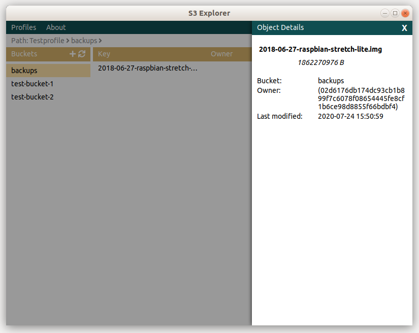

# S3-Explorer

A light-weight GUI for browsing files inside S3, compatible with Amazon S3, MinIO and others.

Available for Windows & Linux (Ubuntu)

## Download
https://indece.com/software/s3-explorer

## Development
### Requirements
* nodejs/npm
* go >= 1.14
* docker
* github.com/google/go-licenses

### Linting
`> make lint --always-make`

### Build
`> make --always-make`

### Release build
`> BUILD_VERSION=1.0.0 CODESIGN_CERT=/home/ubuntu/cert.pem make release --always-make`
